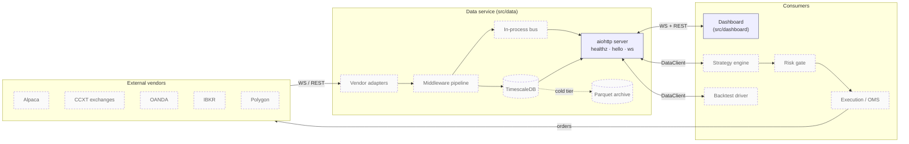
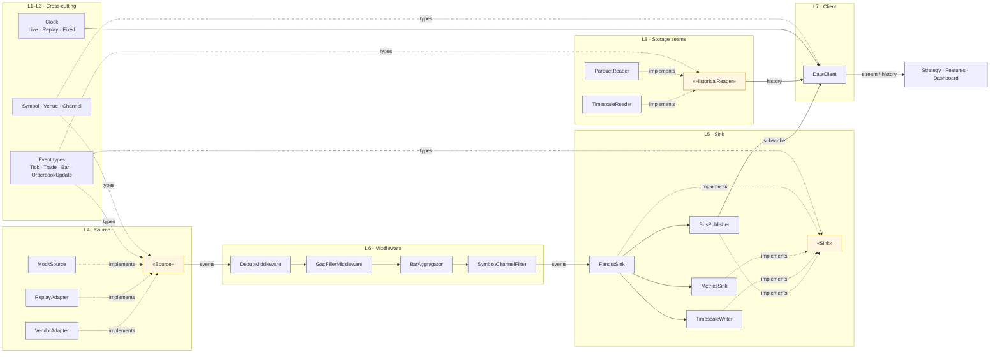
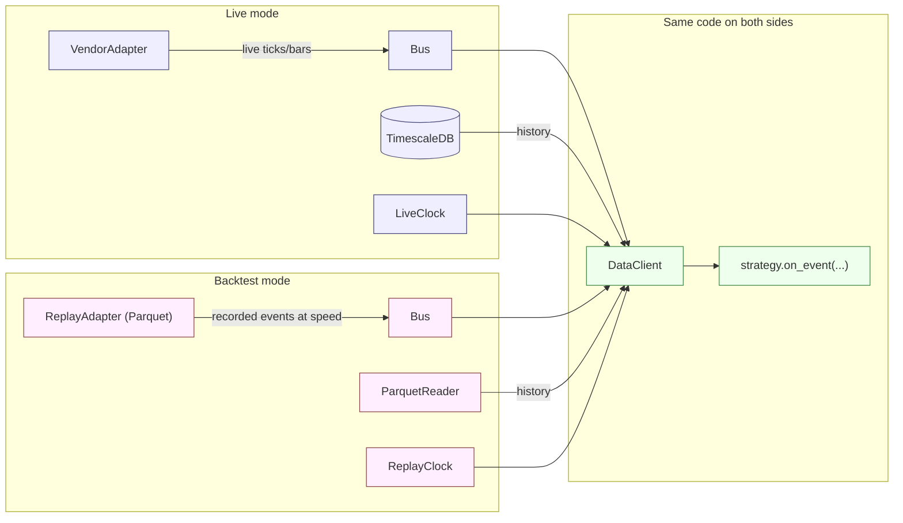

# Component interactions

Three diagrams. Top-down: system view → data-layer internals → live-vs-backtest swap. Boxes labelled `(planned)` aren't built yet; everything else corresponds to code on disk today.

Cross-references:
- [`data-module.md`](./data-module.md) — full prose for the data layer.
- [`../plan/data.md`](../plan/data.md) — eight-layer abstraction plan.
- [`../plan/dashboard.md`](../plan/dashboard.md) — UI plan.

## 1. System overview

The `aiohttp server` box is what runs today (`src/data/main.py`). Everything around it is on the roadmap.

## 2. Data layer internals (the eight abstractions)

Solid arrows are runtime data flow. Dotted arrows are type / protocol references. The same `DataClient` is the only consumer-facing surface; whatever sits behind the bus and reader can change without touching strategies.

## 3. Live vs backtest — same code, different wiring

The strategy code path doesn't branch on mode. The choice happens once at startup — which `Source`, which `HistoricalReader`, which `Clock` — and after that the world looks identical to the strategy.
